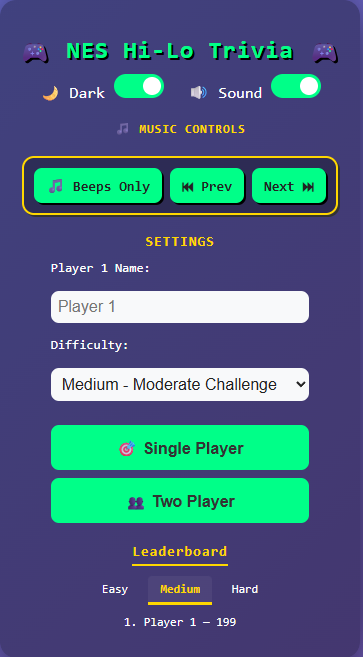
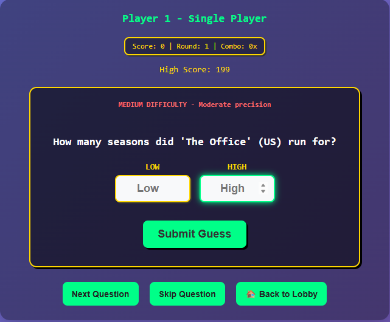
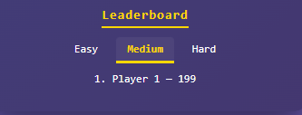

# 🎯 Hi-Low Trivia – NES Style

Welcome to **Hi-Low Trivia**, the third game in my 90s Nintendo-style browser game collection!  
Following the success of **Hangman NES Edition** and **NES Crossword**, this game challenges players with fast-paced trivia questions — but with a twist:  
you win by **guessing the correct number range**.

---

## 🎮 Game Features

- 🔢 **Number-Based Trivia Questions**  
  Guess the correct number by entering a low and high value (e.g., *"How old was MLK when he was assassinated?"*)

- 🧠 **Three Difficulty Levels**  
  Select from Easy, Medium, or Hard.

- 👥 **1 Player and 2 Player Modes**  
  Switch seamlessly between solo mode or versus mode for head-to-head action.

- 🔄 **Random Trivia Pool**  
  Dynamically pulled trivia to keep each round fresh.

- 💯 **Streak Bonus System**  
  Earn bonus points for consecutive correct guesses in single-player mode.

- 🏆 **Leaderboard Tabs**  
  View scores by *All Time* and *Today*.

- 🎵 **Built-In Music Playlist**  
  NES-inspired YouTube music player with **Next/Prev** controls.

- 🌑🌕 **Dark Mode + Sound Toggle**  
  Mobile-first interface with toggles for sound effects and night mode.

- 📱 **Fully Responsive PWA**  
  - Looks and feels like a native app when installed.  
  - No browser bar on mobile.  
  - Launch it from your home screen!

---

## 📸 Screenshots

| Lobby | Game Screen | Leaderboard |
|-------|-------------|-------------|
|  |  |  |

---

## 🚀 How to Play

1. Choose difficulty and game mode.
2. Read the trivia question.
3. Enter your **Low Guess** and **High Guess**.
4. Submit and see if your range covers the correct answer!
5. Keep your streak alive to rack up points.

---

## 🛠️ Tech Stack

- HTML, CSS, JavaScript (Vanilla)
- YouTube iFrame Player API
- [Open Trivia DB API](https://opentdb.com/) (for random questions)
- PWA (Progressive Web App) functionality

---

## 📂 Game Series

This is **Game 3** of my retro-style browser game collection:

1. 🎮 [Hangman NES Edition](#)
2. ✍️ [NES Crossword](#)
3. 🎯 Hi-Low Trivia ← *You're here!*

---

## 📲 Installation

1. Clone the repo or [download the ZIP](#).
2. Open `index.html` in a browser — or deploy it to GitHub Pages / Render.
3. On mobile, tap "Add to Home Screen" for native-like play!

---

## 📜 License

MIT License.  
Built with ❤️ by Melvin Bonner.
